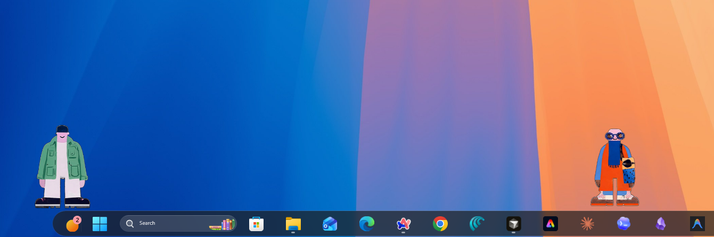

# DockDuo

[](https://github.com/anujdevsingh/dockduo/releases/latest)
[](LICENSE)
[](https://github.com/anujdevsingh/dockduo/releases/latest)
[](https://tauri.app)



**Two animated pixel-art characters — Bruce and Jazz — that live on your Windows taskbar and talk to **Claude Code**, **OpenAI Codex**, and **Google Gemini** through a floating chat bubble.**

DockDuo is the Windows port of Ryan Stephen's macOS
[`lil-agents`](https://github.com/ryanstephen/lil-agents). MIT-licensed, no
telemetry, no cloud, no account, no phoning home. About 25 MB on disk,
~50 MB RAM idle.

---

## Quick install

Download **`DockDuo_0.2.1_x64-setup.exe`** from the [**Releases**](https://github.com/anujdevsingh/dockduo/releases/latest) page (or the newest installer listed there) → double-click → accept the SmartScreen prompt once → done.

No admin required. Installs per-user to `%LOCALAPPDATA%\Programs\DockDuo\`.

### What's new in v0.2.1

- **Bubble chat** — Click a character to open a **floating chat window** above the sprite (lil-style). All three agents — **Claude**, **Codex**, and **Gemini** — use the same warm transcript UI. No separate raw-terminal window inside the app.
- **Agent picker** — If more than one CLI is installed, choose which agent to chat with. With only one CLI, the bubble opens immediately.
- **Session-friendly UX** — Closing the bubble **does not** kill the chat session; click again to continue. **End session** in the bubble clears the backend session when you want a fresh start.
- **Thinking indicator** — Animated dots while the model is working; the sprite still shows rotating **thinking phrases** and **completion** celebrations when the CLI goes idle.
- **Safer agent spawns** — Sandboxed working directories under `%APPDATA%\DockDuo\agents\`, hardened Windows `.cmd` shim handling, and stricter IPC validation (see `docs/DECISIONS.md` if you care about the details).
- **In-app updates** when using signed release builds.
- **Multi-monitor** taskbar overlays are still deferred — see `docs/DECISIONS.md` D-011.

---

## What it does

- Two sprite characters walk back and forth just above your taskbar.
- **Click a character** → if several CLIs are installed, pick **Claude**, **Codex**, or **Gemini** → a **chat bubble** opens above them. The walk animation **pauses** until you close the bubble (`Esc`, **×**, or click the sprite again).
- **Type in the bubble** — messages run the real CLI on your PC; replies stream into the transcript. Click the same agent again to keep the conversation; switch agents to start a new session for that character.
- While the CLI is running, the character can show a thinking bubble cycling through **rotating phrases** ("hmm...", "cooking...", …).
- When the CLI exits, the character **celebrates** with completion phrases and a soft chime.
- **`Ctrl+Shift+L`** hides or shows all overlay windows instantly.

---

## Supported AI CLIs

DockDuo does **not** bundle any CLI. You install whichever you want; DockDuo
auto-detects them at launch and re-checks when you open the agent picker.

| Provider    | Binary   | Install command                             |
| ----------- | -------- | ------------------------------------------- |
| Claude Code | `claude` | `npm install -g @anthropic-ai/claude-code`  |
| Codex       | `codex`  | `npm install -g @openai/codex`              |
| Gemini CLI  | `gemini` | `npm install -g @google/generative-ai-cli`  |

If a CLI isn't installed yet, the onboarding screen shows you the exact
install command and re-checks after you've run it.

> DockDuo runs your installed CLI as a local subprocess and shows its output in the chat bubble. It does not send your prompts or replies to DockDuo’s servers — there are none.

---

## Install in detail

1. Go to the
   [Releases page](https://github.com/anujdevsingh/dockduo/releases/latest)
   and download the latest `DockDuo_*_x64-setup.exe`.
2. Double-click it. No admin prompt — it installs per-user to
   `%LOCALAPPDATA%\Programs\DockDuo\`.
3. Launch DockDuo from the Start menu. The onboarding window walks you
   through picking your AI provider.

### Windows SmartScreen warning

Unsigned (or newly signed) installers often trigger SmartScreen. On first launch you may see:

> **Windows protected your PC**
> Microsoft Defender SmartScreen prevented an unrecognized app from starting.

This is common for indie tools. To run anyway:

1. Click **More info** (small text under the message).
2. Click **Run anyway** (button that appears after "More info").

You may only need to do this once per installer. EV code signing is on the roadmap as the project grows.

---

## First run

1. Onboarding window opens (one time only).
2. Pick a provider for Bruce, pick a provider for Jazz. You can choose the
   same CLI for both if you want.
3. Hit **Get started**. The window closes and the characters start walking.
4. A tray icon appears in your system tray with theme and update controls.

---

## Keyboard shortcuts

| Shortcut        | Action                            |
| --------------- | --------------------------------- |
| `Ctrl+Shift+L`  | Toggle all taskbar overlays on / off |

---

## Tray menu

Right-click the DockDuo tray icon for:

- **Show / Hide DockDuo** — same as `Ctrl+Shift+L`
- **Theme** — Midnight · Daylight · Pastel · Retro (live switch, no restart)
- **Start with Windows** — per-user autostart, no admin needed
- **Hide on fullscreen** — auto-hides when a fullscreen app takes focus (games, videos)
- **Check for updates…** — GitHub Releases (signed release builds)
- **About DockDuo** (version from `Cargo.toml`)
- **Quit**

Chat is always from the **sprite + bubble** — there is no separate “terminal mode” submenu.

---

## System requirements

- **OS:** Windows 10 (21H2+) or Windows 11, 64-bit
- **WebView2:** auto-installed by the bundled bootstrapper if missing
- **Disk:** ~25 MB installed
- **RAM:** ~50 MB idle
- **Display:** any; primary-taskbar monitor only (multi-monitor deferred —
  see `docs/DECISIONS.md` D-011)

---

## Privacy & data

- **No telemetry.** DockDuo does not send analytics, crash reports, or usage
  stats anywhere — there is no backend.
- **No cloud, no account, no sign-in.** Everything is local.
- **Only outgoing connection:** the optional updater check against GitHub
  Releases when you click **Check for updates…** (requires a signed build).
- **Your CLI’s traffic is between you and the provider** (Anthropic, OpenAI, Google) — same as running the CLI in a terminal yourself.
- Config, logs, and per-character agent sandboxes stay under `%APPDATA%\DockDuo\`; nothing is uploaded by DockDuo.

---

## Configuration & logs

DockDuo writes config and logs under your user profile only:

- **Config:** `%APPDATA%\DockDuo\config.json`
- **Logs:** `%APPDATA%\DockDuo\logs\DockDuo.log`
- **Agent sandboxes (CLI default cwd for tool use):** `%APPDATA%\DockDuo\agents\bruce\` and `…\jazz\`

Uninstalling removes the install dir. If you want a full wipe, also delete
`%APPDATA%\DockDuo\`.

---

## Uninstall

1. **Settings → Apps → Installed apps → DockDuo → Uninstall**, or
2. run `%LOCALAPPDATA%\Programs\DockDuo\uninstall.exe`.
3. (Optional) Delete `%APPDATA%\DockDuo\` to wipe config + logs.

---

## Build from source

```powershell
# Prereqs: Node 20+, pnpm 9+, Rust stable, WebView2 SDK
git clone https://github.com/anujdevsingh/dockduo.git
cd dockduo
pnpm install
pnpm tauri dev          # runs in dev mode with hot reload
pnpm tauri build        # produces the NSIS installer
```

The installer lands in `src-tauri/target/release/bundle/nsis/`.

### Project layout

```
src/                         React 19 / TypeScript (overlay, onboarding, AgentChat bubble)
src-tauri/src/               Rust backend (windows, tray, config, CLI integration)
src-tauri/src/bubble.rs      Chat bubble window show/hide + positioning
src-tauri/src/chat/          Claude / Codex / Gemini pipes + session commands
src-tauri/src/binary_resolve.rs   Locate claude / codex / gemini on Windows
src-tauri/icons/             App icons (all sizes)
public/sprites/              Sprite sheets for Bruce and Jazz
public/sounds/               Completion chimes
scripts/                     Sprite conversion helpers (FFmpeg + sharp)
readme-hero.png              README screenshot (commit this file beside README.md)
docs/DockDuo-BuildPlan.md    Canonical build plan
docs/DECISIONS.md            Architectural notes (D-001 …)
.github/workflows/           CI build + release pipelines
```

---

## FAQ

**Does it work offline?**
The overlay works offline. The AI CLI you use needs network for the provider; that is unchanged from running the CLI yourself.

**Can I use a CLI that isn't in the list?**
Not in v0.2.x — the three providers are wired in code. Custom providers are on the roadmap (see below).

**Why two characters instead of one?**
Same idea as upstream lil-agents — e.g. Bruce for Claude, Jazz for Codex. You can point both at the same CLI if you like.

**Will DockDuo read or log my prompts?**
DockDuo streams subprocess output to paint the bubble. It does not send that text to DockDuo servers. Logs may contain CLI stderr lines; keep logs local if they ever include sensitive paths.

**How does "Check for updates…" work?**
Releases use the Tauri updater with a signed manifest. Unsigned local dev builds may not update — use a release installer to verify.

**Why SmartScreen warns me?**
The installer may be unsigned or newly signed. See [Windows SmartScreen warning](#windows-smartscreen-warning) above.

---

## Roadmap

- **v0.2.x** — Polish, bugfixes, multi-monitor overlays (D-011)
- **v0.3.0** — Custom-provider plugin (arbitrary CLI)
- **Later** — More character pairs, themeable sound packs, Linux port, EV code signing

---

## Credits & License

DockDuo is MIT-licensed. Character artwork and sounds are inherited under
MIT from the upstream macOS project. Full attribution lives in
[`CREDITS.md`](CREDITS.md); license text is in [`LICENSE`](LICENSE).

Huge thanks to **Ryan Stephen** for the original
[`lil-agents`](https://github.com/ryanstephen/lil-agents) on macOS — Bruce
and Jazz were born there, and they walk on your Windows taskbar today
because Ryan's MIT license made it possible.

Built on [Tauri 2](https://tauri.app) with React 19 + Rust stable.

---

## Contributing / feedback

- **Bug?** Open an
  [issue](https://github.com/anujdevsingh/dockduo/issues).
- **Feature request?** Open an issue or a PR. Small focused PRs welcome.
- **Just want to say "this is cute"?** Star the repo.
