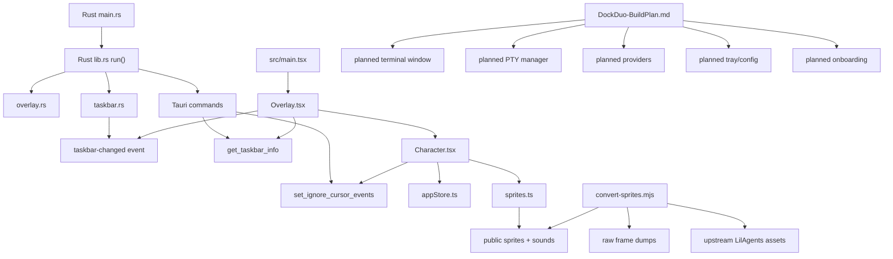

# DockDuo Project Graph Report

Generated on 2026-04-19 from the current `dockduo` repository as a local fallback for `/graphify`.

## Snapshot

- Project type: Tauri 2 desktop app with a React frontend and Rust backend
- Current maturity: foundation plus character prototype
- Current live architecture: one transparent overlay window, two animated characters, Win32 taskbar polling, hover-based click-through toggling
- Main intent source: [docs/DockDuo-BuildPlan.md](/E:/projects/dockduo/docs/DockDuo-BuildPlan.md)
- Machine-readable graph: [graph.json](/E:/projects/dockduo/docs/project-graph/graph.json)

## Executive Summary

`dockduo` is already more than a blank Tauri scaffold. The codebase has the Phase 1 backbone working and also includes a meaningful slice of Phase 2 behavior:

- The Rust side can detect the Windows taskbar and reposition the overlay around it.
- The frontend already renders Bruce and Jazz as animated sprite characters.
- The overlay is click-through by default and temporarily becomes interactive only when the pointer enters a character hitbox.
- The asset pipeline for sprite sheets and sounds exists and points back to an imported `LilAgents` upstream source.

The biggest mismatch between "what exists" and "what the product is meant to become" is that the build plan describes a much larger system: terminal windows, PTY sessions, provider detection, tray state, onboarding, full-screen hiding, and more. Those systems are still specification-only.

## High-Level Map

## Current Runtime Graph

### 1. Frontend entry and window routing

[src/main.tsx](/E:/projects/dockduo/src/main.tsx) is the browser-side entrypoint. It reads the `window` query parameter and currently supports only the `overlay` route. That means the project is still single-window at runtime even though the product plan expects multiple windows later.

### 2. Overlay orchestration

[src/windows/Overlay.tsx](/E:/projects/dockduo/src/windows/Overlay.tsx) is the center of the current frontend runtime. It:

- requests initial taskbar geometry through `get_taskbar_info`
- subscribes to `taskbar-changed`
- computes overlay width and height from the browser window
- renders two `Character` instances
- simulates AI activity state for now when a character is clicked

This is the most central frontend node in the current graph.

### 3. Character engine

[src/components/Character.tsx](/E:/projects/dockduo/src/components/Character.tsx) is the behavior-heavy component. It combines:

- sprite frame stepping
- horizontal movement over a track
- hitbox placement
- bubble text state
- audio playback on completion
- bridge calls back into Rust for click-through toggling

This file is where animation, interactivity, and fake AI-state feedback meet.

### 4. Frontend state and domain constants

[src/store/appStore.ts](/E:/projects/dockduo/src/store/appStore.ts) is a tiny custom external store. It only tracks:

- `aiStatus` for each character
- `bounds` for each character

[src/lib/sprites.ts](/E:/projects/dockduo/src/lib/sprites.ts) is the domain table for the current animation system. It defines:

- character ids
- sprite sheet geometry
- walk timing math
- bubble phrase pools
- sound file paths

Together, these two files form the model layer for the current prototype.

### 5. Tauri and Win32 bridge

[src-tauri/src/lib.rs](/E:/projects/dockduo/src-tauri/src/lib.rs) is the backend hub. It:

- configures the overlay window on startup
- starts taskbar polling
- exposes `get_taskbar_info`
- exposes `set_ignore_cursor_events`

[src-tauri/src/overlay.rs](/E:/projects/dockduo/src-tauri/src/overlay.rs) owns transparent overlay behavior and window positioning. It also contains the Windows-specific WebView2 and DWM transparency fixes.

[src-tauri/src/taskbar.rs](/E:/projects/dockduo/src-tauri/src/taskbar.rs) owns taskbar detection, DPI scale handling, monitor bounds, and event emission.

This Rust side is the real foundation of the app. Without it, the React overlay could not align to the Windows taskbar or preserve click-through behavior.

## Asset Pipeline Graph

The asset path is:

1. Imported upstream project in `lil-agents-main/LilAgents`
2. Intermediate PNG frame dumps in `_MConverter.eu_walk-*`
3. Conversion script in [scripts/convert-sprites.mjs](/E:/projects/dockduo/scripts/convert-sprites.mjs)
4. Runtime assets in [public](/E:/projects/dockduo/public)
5. Runtime references from [src/lib/sprites.ts](/E:/projects/dockduo/src/lib/sprites.ts)

This is important because it means the repository already contains provenance for the character visuals and audio, not just the final sprite sheets.

## Planned But Not Yet Implemented

The build plan describes a larger system than the current codebase. These nodes are present in the knowledge graph as planned nodes, not implementation nodes:

- `Terminal.tsx` window for per-character terminals
- `terminal.rs` PTY manager
- `providers.rs` CLI detection layer
- `tray.rs` and `config.rs`
- onboarding modal flow
- fullscreen detection
- richer shared types and IPC wrappers

So the repo currently looks like:

- Implemented now: overlay, animation, taskbar integration, transparent window behavior, basic asset pipeline
- Planned next: real AI terminal sessions and app-level controls

## Important Relationships

These are the most important edges in the graph:

- `Overlay.tsx -> Character.tsx`
  The overlay is just a coordinator; most live behavior is delegated into each character.

- `Character.tsx -> set_ignore_cursor_events`
  This is the key interaction trick that makes a desktop overlay feel native instead of blocking the desktop.

- `taskbar.rs -> taskbar-changed -> Overlay.tsx`
  This event edge keeps the UI pinned to Windows state rather than hard-coding screen assumptions.

- `convert-sprites.mjs -> public assets -> sprites.ts`
  The runtime animation data is tightly coupled to the conversion pipeline.

- `DockDuo-BuildPlan.md -> planned modules`
  The spec is not passive documentation; it is effectively the missing half of the architecture.

## What This Knowledge Base Says About The Repo

The repo is best understood as a split system with four layers:

1. Product intent
   The build plan is extremely detailed and acts like an architectural contract.

2. Native window and OS integration
   Rust owns taskbar geometry, overlay window configuration, and event emission.

3. Browser-side character runtime
   React owns animation, hitboxes, bubbles, and visual feedback.

4. Asset lineage
   Raw frames and upstream source material feed the public runtime assets.

That makes `dockduo` a good fit for graph-style reasoning because several important dependencies are cross-layer rather than purely file-local.

## Central Nodes

If you want to understand the project fastest, read these in order:

1. [docs/DockDuo-BuildPlan.md](/E:/projects/dockduo/docs/DockDuo-BuildPlan.md)
2. [src-tauri/src/lib.rs](/E:/projects/dockduo/src-tauri/src/lib.rs)
3. [src/windows/Overlay.tsx](/E:/projects/dockduo/src/windows/Overlay.tsx)
4. [src/components/Character.tsx](/E:/projects/dockduo/src/components/Character.tsx)
5. [src-tauri/src/taskbar.rs](/E:/projects/dockduo/src-tauri/src/taskbar.rs)
6. [src/lib/sprites.ts](/E:/projects/dockduo/src/lib/sprites.ts)
7. [scripts/convert-sprites.mjs](/E:/projects/dockduo/scripts/convert-sprites.mjs)

## Recommended Next Graph Expansions

If you want this knowledge base to become more "real graphify" over time, the next useful expansions are:

- add code symbols and function-level nodes
- add file-to-import edges automatically
- add planned-vs-implemented status tracking per phase
- add a generated HTML graph view
- add a small regeneration script so this graph can be refreshed after each milestone

## Bottom Line

This repository currently has a strong native-overlay core, a working character prototype, and a clear roadmap. The most central insight from the graph is that the build plan is still structurally important because many of the future product systems exist there before they exist in code.
