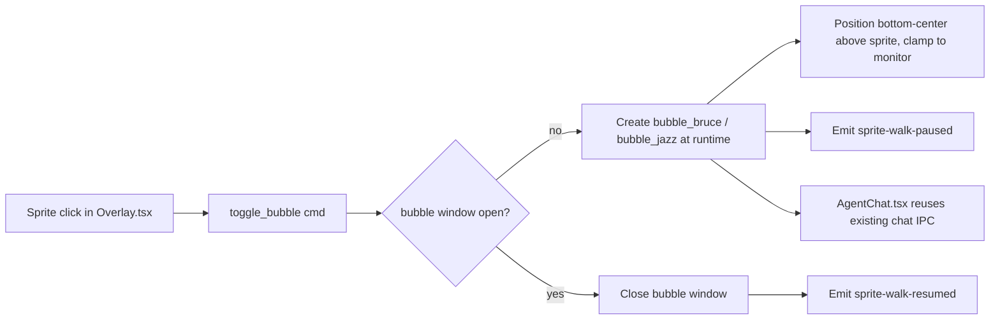

# Bubble-only chat UX

**Status:** Accepted
**Date:** 2026-04-23
**Supersedes:** `docs/superpowers/specs/2026-04-22-lil-agents-chat-parity-design.md` (Chat-vs-Raw tray toggle)

## Summary

Replace the separate Raw and Chat terminal windows with a single per-character
frameless chat "bubble" webview that opens directly above the sprite when
clicked. One way to talk to agents; no tray submenu, no `terminal_*` windows,
no PTY.

## Motivation

The 0.2 release shipped two embedded terminal shells — xterm+PTY ("Raw") and
lil-style chat transcript ("Chat") — both rendered in a separate `terminal_*`
webview window. In practice:

* Two windows to reason about, two lifecycles, two keyboard focus paths.
* The user asked for the macOS-menu-bar-app feel: a speech bubble that pops
  up *above* the walking character rather than a new desktop window.
* Raw's value (native CLI TUI) is small compared to the UX cost of
  maintaining two code paths.

Collapsing to a single bubble simplifies the product and matches the
reference UI (see `docs/superpowers/specs/2026-04-22-lil-agents-chat-parity-design.md`
for the multi-provider chat pipes, which we keep).

## User experience

1. Click Bruce or Jazz.
2. A frameless, rounded chat bubble appears anchored above the sprite,
   clamped inside the monitor rect. No title bar, no taskbar entry.
3. The clicked sprite freezes in place; the other sprite keeps walking.
4. Send messages — Claude, Codex, or Gemini replies stream into the
   bubble via the existing chat IPC.
5. Close by clicking the sprite again, pressing `Esc` inside the bubble,
   or clicking the explicit close button. The session **stays alive**;
   reopening restores the transcript.
6. "End session" button inside the bubble calls `chat_terminate` and
   plays the existing completed → 2.5 s → idle ceremony.
7. Closing the bubble resumes the sprite's walk.

## Architecture

### New Rust module: `src-tauri/src/bubble.rs`

* Commands: `toggle_bubble(character, kind, sprite_center_x)` and
  `close_bubble(character)`.
* Opens `bubble_bruce` / `bubble_jazz` via `WebviewWindowBuilder` with
  `decorations(false)`, `resizable(false)`, `skip_taskbar(true)`,
  `always_on_top(true)`, `transparent(true)`, `shadow(true)`,
  `visible(true)`, `focused(true)`.
* Fixed size: 420 × 520 CSS px (revisable later if users want resize).
* Positions the bubble by combining `taskbar::current()` and the
  sprite's reported `centerX` so the bubble's bottom-center sits a few
  px above the overlay top. Clamped to the monitor rect.
* Emits `sprite-walk-paused` / `sprite-walk-resumed` scoped to the
  specific `character` so the *other* sprite keeps walking.
* Auto-closes on focus loss via `on_window_event(WindowEvent::Focused(false))`
  after a short debounce (200 ms) so clicking into the input field
  doesn't race the close.

### Frontend routing

* `src/main.tsx` — `label.startsWith("bubble_")` branches to `<AgentChat />`
  (no more `EmbeddedTerminalShell`, no `terminal_*` branch).
* `src/windows/Overlay.tsx` — click handler calls
  `invoke("toggle_bubble", { character, kind, spriteCenterX })` and
  listens for `sprite-walk-paused` / `sprite-walk-resumed` events to
  pause per-character walk animation.
* `src/components/Character.tsx` — accepts a `paused` prop; when `true`,
  the rAF loop skips position and frame updates.
* `src/windows/AgentChat.tsx` — restyle outer frame as a speech bubble
  (rounded, drop shadow, pointer triangle), add explicit End session
  button, handle `Esc` → close (keep session), remove Raw/Chat banners.

### Removals

* Delete `src-tauri/src/pty.rs` (entire file: session manager,
  `show_embedded_terminal`, `spawn_embedded_agent`, `pty_write`,
  `pty_resize`, `pty_kill`, `pty_has_session`,
  `set_pending_embedded`, `take_pending_embedded`).
* Remove `use_embedded_terminal`, `EmbeddedUiMode`, and
  `embedded_ui_mode` from `src-tauri/src/config.rs` (silently ignore in
  on-disk config on load via `#[serde(default)]` on a stub or via
  `serde(flatten)` catch-all). Remove related commands.
* `src-tauri/src/tray.rs` — drop the Terminal submenu and associated
  menu item IDs; remove `sync_terminal_checks`.
* `src-tauri/src/lib.rs` — remove `set_embedded_ui_mode`,
  `pty::*` registrations; add `bubble::*` registrations.
* `src-tauri/src/chat/session.rs` — drop `emit_embedded_ui_prefs`
  / `embedded-ui-mode-changed`; remove the `pty::has_session` guard
  (no PTY to conflict with).
* `src-tauri/src/claude.rs` — drop the `pty::has_session` guard
  (`chat::has_any_chat_session` still stands).
* `src-tauri/capabilities/default.json` — drop `terminal_*` labels;
  add `bubble_*`.
* `src-tauri/tauri.conf.json` — drop `terminal_bruce` / `terminal_jazz`
  window configs.
* `src/windows/Terminal.tsx` — deleted.

### Interaction with detached-console `spawn_agent`

`claude::spawn_agent` (the detached-console path invoked when the user
once toggled "System terminal" off-feature) still exists but is only
reachable if another caller asks for it. With Raw gone we simply stop
wiring UI to it; the function itself stays for now in case we bring
back a power-user option later. The cross-guard against
`chat::has_any_chat_session` stays.

## Migration

* On-disk `config.json` may still contain `use_embedded_terminal`
  and `embedded_ui_mode`. Load tolerates unknown fields thanks to
  `serde`'s default behaviour; we simply stop deserialising them.
  Next save rewrites the file without those fields.
* Existing users lose their Raw/Chat preference (there's only one mode
  now). No warning shown.
* Windows batch-shim wrapping (`command_for_agent_binary`) stays in
  `binary_resolve.rs` so Codex/Gemini shims still spawn correctly.

## Risks

* **Focus-based auto-close** on Windows can fire during input method
  editor activation or dropdowns; mitigated by a short debounce and an
  "input focused" guard.
* **Multi-monitor** position math is deferred — bubble opens on the
  primary monitor's overlay. Re-pos on monitor change is future work.
* **Fullscreen apps**: the existing `fullscreen.rs` poller hides the
  overlay; we extend it to also hide `bubble_*` windows.

## Testing

* Unit: existing `chat::*` parser tests unchanged. Add a placeholder
  for the bubble close-vs-terminate distinction once implementation
  lands (close hides window, terminate ends session).
* Manual: click Bruce → bubble appears above him; Jazz walk continues;
  click outside → bubble closes; Bruce resumes walking; reopen → old
  transcript preserved; End session → green chime + 2.5 s idle.
* Regression: tray has no Terminal submenu; no `terminal_*` window is
  ever created; config file from previous version loads without error.

## Out of scope

* Multi-monitor bubble re-positioning when the primary monitor changes
  mid-session.
* Resizable / draggable bubble.
* Inline tool approval UI (still uses assistant text).
